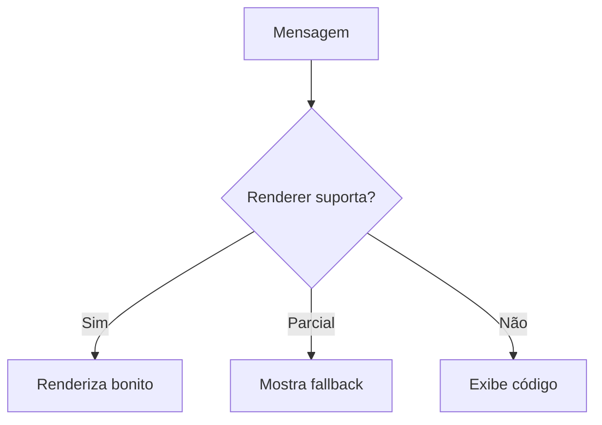
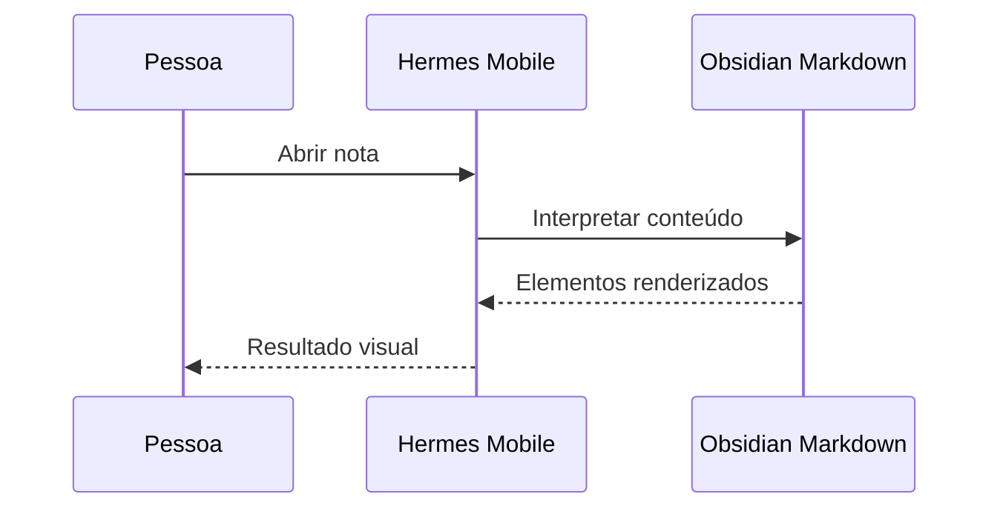

# Obsidian Markdown Renderer Showcase

> [!abstract] Objetivo do teste
> Nota sintética para validar o renderer do Hermes Mobile. O conteúdo é intencionalmente variado e descartável.

## Índice rápido

- [[#Texto e formatação]]
- [[#Listas e tarefas]]
- [[#Tabela]]
- [[#Links, referências e embeds]]
- [[#Código, fórmulas e diagramas]]
- [[#Todos os callouts nativos e aliases]]
- [[#Recursos extras e limites]]

---

## Texto e formatação

Texto simples, **negrito**, *itálico*, ***negrito e itálico***, ~~tachado~~, ==realçado==, `código inline` e <mark>HTML marcado</mark>.

Linha com caracteres escapados: \*não itálico\*, \#não é tag, \[colchetes\] e &amp; entidade HTML.

> Uma citação Markdown comum.
>
> Com um segundo parágrafo e **formatação** interna.

### Hierarquia de títulos

#### Título de nível 4

##### Título de nível 5

###### Título de nível 6

Texto com quebra de linha forçada: primeira linha  
segunda linha.

---

## Listas e tarefas

### Lista não ordenada

- Item A
- Item B
  - Item B.1
    - Item B.1.a
  - Item B.2
- Item C com `código`

### Lista ordenada

1. Primeiro passo
2. Segundo passo
   1. Subpasso 2.1
   2. Subpasso 2.2
3. Terceiro passo

### Lista mista

1. Planejar
   - Pesquisar
   - Registrar
2. Executar
   - [x] Tarefa concluída
   - [ ] Tarefa pendente
     - [x] Subtarefa concluída
     - [ ] Subtarefa pendente

### Checklist com estados visuais

- [ ] Não iniciado
- [/] Em andamento (extensão comum)
- [x] Concluído
- [-] Cancelado (extensão comum)
- [>] Adiado (extensão comum)
- [!] Importante (extensão comum)

---

## Tabela

| Elemento | Markdown | Esperado no renderer | Estado |
|:--|:--:|--:|--:|
| Negrito | `**texto**` | **Visível** | ✅ |
| Itálico | `*texto*` | *Visível* | ✅ |
| Código | `` `valor` `` | `valor` | ✅ |
| Tag | `#teste/mobile` | #teste/mobile | 🧪 |
| Link | `[rótulo](https://example.com)` | [rótulo](https://example.com) | 🔗 |

| Coluna esquerda | Coluna central | Coluna direita |
|:--|:--:|--:|
| A | B | C |
| Texto longo para quebra automática | Meio | Fim |

---

## Links, referências e embeds

- Link externo: [Obsidian Help](https://help.obsidian.md/)
- URL automática: <https://hermes-agent.nousresearch.com/docs>
- E-mail automático: <teste@example.com>
- Wikilink: [[Nota inexistente]]
- Wikilink com rótulo: [[Nota inexistente|Texto de exibição]]
- Wikilink para título local: [[#Tabela]]
- Link de bloco local: [[#^bloco-destino]]
- Embed de nota: ![[Nota inexistente]]
- Embed de seção: ![[Nota inexistente#Seção]]
- Embed de imagem local: ![[imagem-inexistente.png|300]]
- Embed de PDF: ![[arquivo-inexistente.pdf#page=2]]

Este parágrafo possui um identificador de bloco para testar links internos. ^bloco-destino

Texto com nota de rodapé convencional[^convencional] e nota de rodapé inline.^[Esta é uma nota de rodapé inline.]

[^convencional]: Conteúdo da nota de rodapé convencional, com **negrito** e um [link](https://example.com).

---

## Tags, comentários e metadados

Tags inline: #renderer #teste/mobile #obsidian/markdown #categoria-com-hifen #tag_com_underscore.

Texto visível %%e comentário inline oculto no Reading View%% continua aqui.

%%
Este é um comentário em bloco: o Obsidian deve escondê-lo no modo de leitura.
%%

> [!info] Propriedades
> O frontmatter no início desta nota testa string, lista, data, tags e `cssclasses`.

---

## Código, fórmulas e diagramas

### Bloco sem linguagem

```
texto monoespaçado
  com indentação
<e caracteres especiais>
```

### Blocos com syntax highlighting

```python
def saudacao(nome: str) -> str:
    return f"Olá, {nome}!"

print(saudacao("Pessoa"))
```

```json
{
  "renderer": "Hermes Mobile",
  "features": ["markdown", "obsidian", "callouts"],
  "ok": true
}
```

```bash
printf '%s\n' 'teste do renderer'
```

### Fórmulas

Fórmula inline: $E = mc^2$ e $\sum_{i=1}^{n} i = \frac{n(n+1)}{2}$.

$$
\int_{0}^{1} x^2\,dx = \frac{1}{3}
$$

### Mermaid





---

## Todos os callouts nativos e aliases

> [!note] note
> Callout base do tipo `note`.

> [!abstract] abstract
> Tipo principal de resumo/abstração.

> [!summary] summary (alias de abstract)
> Alias pedido para teste.

> [!tldr] tldr (alias de abstract)
> Resumo muito curto.

> [!info] info
> Informação contextual.

> [!todo] todo
> Algo a fazer.

> [!tip] tip
> Dica principal.

> [!hint] hint (alias de tip)
> Uma pista.

> [!important] important (alias de tip)
> Algo importante.

> [!success] success
> Operação bem-sucedida.

> [!check] check (alias de success)
> Checagem aprovada.

> [!done] done (alias de success)
> Concluído.

> [!question] question
> Uma pergunta.

> [!help] help (alias de question)
> Pedido de ajuda.

> [!faq] faq (alias de question)
> Pergunta frequente.

> [!warning] warning
> Aviso importante.

> [!caution] caution (alias de warning)
> Cuidado.

> [!attention] attention (alias de warning)
> Atenção.

> [!failure] failure
> Falha genérica.

> [!fail] fail (alias de failure)
> Falhou.

> [!missing] missing (alias de failure)
> Está faltando.

> [!danger] danger
> Risco alto.

> [!error] error (alias de danger)
> Erro crítico.

> [!bug] bug
> Comportamento inesperado.

> [!example] example
> Exemplo concreto.

> [!quote] quote
> "Citações tornam o teste mais completo."

> [!cite] cite (alias de quote)
> Fonte ou referência.

> [!idea] idea
> Uma ideia a explorar.

### Callouts com comportamentos especiais

> [!warning] Título personalizado
> O tipo e o título são independentes.
>
> Segundo parágrafo dentro do mesmo callout.
>
> - Lista interna
> - [x] Tarefa interna concluída
> - [ ] Tarefa interna pendente

> [!faq]- Callout fechado por padrão
> Este conteúdo deve começar recolhido quando o renderer suporta callouts expansíveis.

> [!example]+ Callout aberto por padrão
> Este conteúdo deve começar expandido, mas continuar recolhível.

> [!question] Callout aninhado
> Conteúdo do callout externo.
>
> > [!idea] Callout interno
> > Conteúdo aninhado com **negrito** e `código`.

> [!abstract] Callout com tabela
> | Chave | Valor |
> |---|---:|
> | A | 1 |
> | B | 2 |

> [!custom-type] Callout CSS personalizado
> Este tipo só terá aparência especial se houver um snippet CSS correspondente; sem ele, serve para testar fallback.

---

## Recursos extras e limites

<details>
<summary>Bloco HTML expansível</summary>

Conteúdo dentro de `details`, com **Markdown** e uma lista:

- Item ocultável 1
- Item ocultável 2

</details>

<kbd>Ctrl</kbd> + <kbd>K</kbd> é uma combinação de teclas demonstrativa.

<blockquote>
  Citação em HTML para comparar com blockquote Markdown.
</blockquote>

<dl>
  <dt>Termo</dt>
  <dd>Descrição HTML opcional.</dd>
</dl>

---

## Critério final de renderização

> [!success] Se você consegue ler esta caixa, a nota chegou até o app 🦉
> Teste os links, os callouts fechados, as tabelas, os códigos, as fórmulas e o Mermaid. Onde algo não renderizar, o fallback em texto ainda deve ser compreensível.

Fim da nota de teste.
